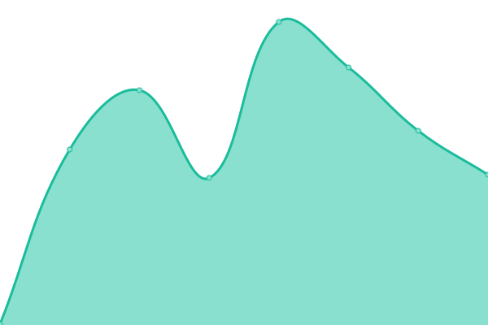

# [📈 Live Status](https://bronxi47.github.io/upptime): <!--live status--> **🟧 Partial outage**

This repository contains the open-source uptime monitor and status page for [bronxi](constata.eu), powered by [Upptime](https://github.com/upptime/upptime).

With [Upptime](https://upptime.js.org), you can get your own unlimited and free uptime monitor and status page, powered entirely by a GitHub repository. We use [Issues](https://github.com/bronxi47/upptime/issues) as incident reports, [Actions](https://github.com/bronxi47/upptime/actions) as uptime monitors, and [Pages](https://bronxi47.github.io/upptime) for the status page.

<!--start: status pages-->
<!-- This summary is generated by Upptime (https://github.com/upptime/upptime) -->
<!-- Do not edit this manually, your changes will be overwritten -->
<!-- prettier-ignore -->
| URL | Status | History | Response Time | Uptime |
| --- | ------ | ------- | ------------- | ------ |
|  [Constata WebSite | constata.eu](https://constata.eu) | 🟩 Up | [constata-web-site-constata-eu.yml](https://github.com/bronxi47/uptime_test/commits/HEAD/history/constata-web-site-constata-eu.yml) | 

 126ms
     
 | 

<a href="https://bronxi47.github.io/uptime_test/history/constata-web-site-constata-eu">100.00%</a>
    

|  [API Constata Production](https://api.constata.eu) | 🟥 Down | [api-constata-production.yml](https://github.com/bronxi47/uptime_test/commits/HEAD/history/api-constata-production.yml) | 

 261ms
     
 | 

<a href="https://bronxi47.github.io/uptime_test/history/api-constata-production">100.00%</a>
    

|  [API Constata Staging](https://api.constata.eu/) | 🟥 Down | [api-constata-staging.yml](https://github.com/bronxi47/uptime_test/commits/HEAD/history/api-constata-staging.yml) | 

 121ms
     
 | 

<a href="https://bronxi47.github.io/uptime_test/history/api-constata-staging">100.00%</a>
    

|  [Site broken test](https://thissitedoesnotexist.koj.co) | 🟥 Down | [site-broken-test.yml](https://github.com/bronxi47/uptime_test/commits/HEAD/history/site-broken-test.yml) | 

 0ms
     
 | 

<a href="https://bronxi47.github.io/uptime_test/history/site-broken-test">100.00%</a>
    

<!--end: status pages-->

[**Visit our status website →**](https://bronxi47.github.io/upptime)

## 📄 License

- Powered by: [Upptime](https://github.com/upptime/upptime)
- Code: [MIT](./LICENSE) © [bronxi](constata.eu)
- Data in the `./history` directory: [Open Database License](https://opendatacommons.org/licenses/odbl/1-0/)
